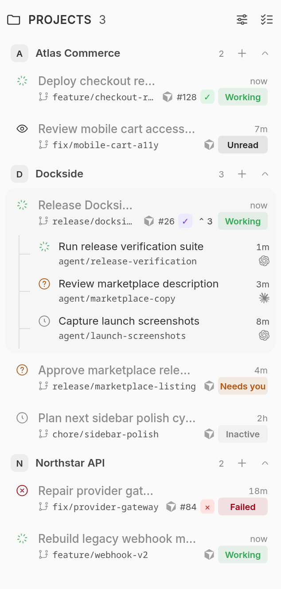
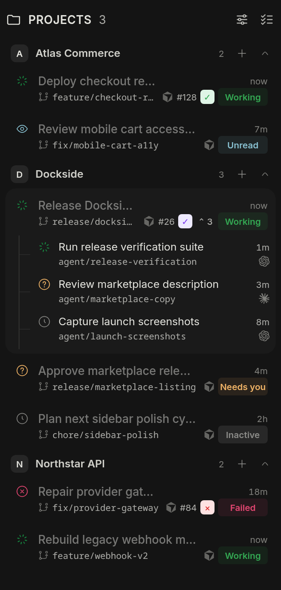
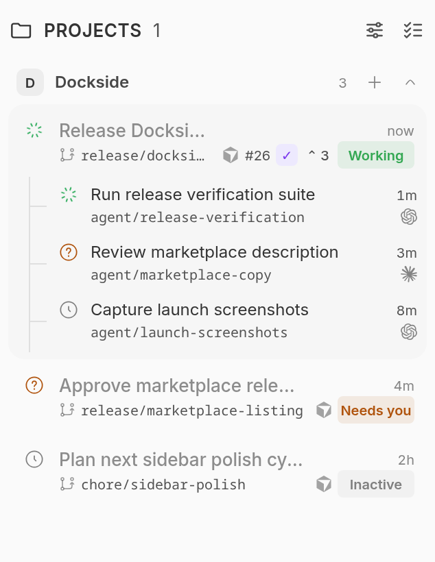
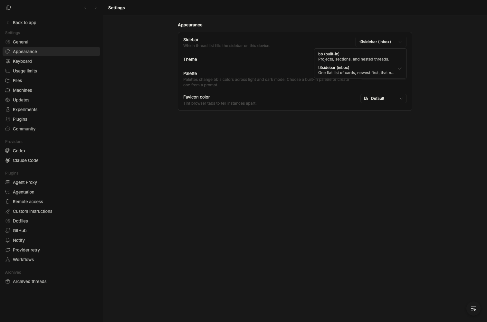

<div align="center">

<picture>
  <source media="(prefers-color-scheme: dark)" srcset="assets/logo-dark.svg" />
  
</picture>

# Nest

**Stable projects, clear attention, inline agents.**


</div>

Nest replaces the scrolling thread list in bb's left sidebar with a
compact project-first inbox designed for parallel agent work.

The project list is bb's project list. Every project gets a row whether or not it
has a thread yet, so a project you just created is on the sidebar the moment it
exists rather than the moment you start something in it; a project with nothing in
it yet shows a placeholder where its threads will go. Under a project, its
workspaces — the checkout and each worktree — become rows of their own once there
is more than one to tell apart, and while the project has no threads yet, so a
worktree you just created is on screen before anything runs in it. A workspace
outlives the conversations in it: settle the last thread in a worktree and its row
stays, because the worktree is still there to start the next one in.

Projects and complete root/child families stay where you put them. Drag the
existing project header or a family's semantic status icon to sort, or use
Alt+Up/Alt+Down from the same focus targets. The order is kept on the server, so
it follows you across clients, and it survives reloads; children remain attached,
and pinned roots retain their leading partition. Sorting pauses during search,
filtering, or bulk selection so hidden rows never move implicitly.

Every family has an explicit **Failed**, **Needs you**, **Working**, **Unread**,
**Inactive**, or seven-day **Stale** state. Labels, distinct shapes, animation,
accessible help, and customizable semantic colors keep color from carrying the
meaning alone. Inactive and stale work recedes instead of using a bright unused
state, and Nest never invents Done for ordinary idle work.

When a root has child threads, the family expands inline as an agent stack with
provider marks for Codex, Claude, and other BB providers. Pull-request metadata
stays on the parent only, including semantic ready, merged, and blocked/error
states.

You clear the list with two email verbs: **snooze** a thread until a wake time, or
**settle** it when you are done. Both shelves collapse to one counted header.

## Fork and origin

Nest is a fork, and this repository is the third copy in a short line of them:

| | |
|---|---|
| [`get-bb/bb` → `examples/plugins/t3sidebar`](https://github.com/get-bb/bb/tree/main/examples/plugins/t3sidebar) | the example sidebar every one of these starts from (MIT, Copyright (c) 2026 Michael Yong) |
| [`MateoCerquetella/bb-plugins` → `plugins/dockside`](https://github.com/MateoCerquetella/bb-plugins/tree/main/plugins/dockside) | Dockside, the fork of that sidebar this line descends from (MIT, Copyright (c) 2026 Mateo Cerquetella) |
| the **unpublished Nest fork by verger** | groups, the worktree tree, status rollups, and the row-seeded new-thread dialog — the sidebar this repository started as. It has no public URL: it was installed from a local path source, and its README is the one this one grew out of |
| **this repository**, [`euanguo/bb-plugin-nested-sidebar`](https://github.com/euanguo/bb-plugin-nested-sidebar) | what the sections below describe |

This repository is **not** a GitHub fork: it has no upstream parent on GitHub and
no fork banner, because it was created from a copy of the unpublished fork rather
than through GitHub's fork button. Nothing here tracks an upstream tag, and there
is no "compare against upstream" to follow. The authorship the copy carried over
is recorded in `package.json` (`verger (fork of Dockside by Mateo Cerquetella)`),
and the licence chain in `LICENSE` and `THIRD_PARTY_NOTICES.md`. The ADR that
recorded why the sidebar was forked rather than written from scratch lives outside
this repository, in the workspace the fork was extracted from.

What this repository has added since it was copied is its commit history: the
worktree row carrying its alias and branch, the project's own checkout as a row
of its own that leads its project, removing a worktree, the copy actions on the
workspace and project rows, and the strip's own All and Ungrouped tabs taking an
icon.

## Nest in action

| Light | Dark |
|:--:|:--:|
|  |  |

### Inline subagents

<p align="center">
  
</p>

## Nest in the sidebar

Two things are worth knowing before you tune it:

- Rows are denser than bb's own list by design — the tree carries groups and
  worktrees, so everything that is not the title is a dot, a count, or a
  tooltip. Everything visible can be turned off from Settings.
- The scroll area reserves its scrollbar's own lane (`scrollbar-gutter: stable`)
  and keeps only a token gap beside it, so the tree does not shift sideways the
  moment it grows past the viewport. That area also clips horizontally, so a
  decoration poking past a row can never grow a horizontal scrollbar: the
  status, pull-request and provider tooltips are bounded by the row they hang
  off instead.

## Install

The plugin is **not published to a marketplace** — it is installed from this
repository as a local path source, which is also the loop to develop it in.

```sh
cd path/to/bb-plugin-nested-sidebar
npm install                       # runtime deps + the pinned @get-bb/plugin-sdk
bb plugin build .                 # writes dist/{server,app,host}
bb plugin install "path:$PWD" --yes
```

After an edit, `bb plugin build .` then `bb plugin reload nested-sidebar` is the
short loop; `bb plugin dev .` watches instead. `bb plugin remove nested-sidebar`
uninstalls it, and the local path source stays on disk.

The install used to fail with `Could not resolve "@bb/plugin-sdk"`: the tree
vendored SDK declarations under `types/`. It now depends on the
`@get-bb/plugin-sdk` package instead.

## Requirements

- bb ≥ 0.36
- Nothing else. No accounts, keys, or external services.

## Usage

Installing does not change your sidebar by itself. Open **Settings → Appearance →
Sidebar** and choose **Nest (projects)**.

<picture></picture>

bb's own list stays the default, and comes back the moment you switch away or
disable the plugin.

### Groups

A **group** is a named bucket above projects, and it is the first level of the
tree: `group -> project -> worktree -> thread`. A project belongs to at most one
group; a project in no group lands in **Ungrouped**. Pick a group from the
horizontal strip above the tree (`All | Group A | Group B | Ungrouped`), or open
the folder button there to create, rename, reorder, and delete groups. Deleting a
group only releases its projects back to Ungrouped -- it never removes a project
or a thread.

The folder button opens the manager; a group's own row menu carries the same
decisions for the row you are looking at -- **Rename…**, **Copy group ID**,
**Move up** / **Move down**, and **Remove group**.

The strip is a **scope selector, not a second tree**: choosing a group narrows
what the tree below draws, and projects are still the first level inside it.
**Ungrouped** earns its tab: it appears only once groups exist, and only while it
holds a project, so it is never a second copy of **All** and never a destination
to an empty list. A project filed out of its last group brings it back, and a
selection left on it falls back to **All** rather than scoping the tree to
nothing.

**All** and **Ungrouped** are not groups -- they take no name, cannot be
reordered or removed, and hold no projects -- but they do take an icon, chosen
from the same picker in the group manager. The icon is what the compact strip
draws when it is too narrow for labels, which is the only place any tab's icon
shows; the Ungrouped icon also titles the Ungrouped section in the tree.

### Workspaces and worktrees

The workspace level appears **only when a project's threads occupy more than one
physical workspace**. A project whose threads all sit in one checkout stays flat,
exactly like bb's own sidebar. Nest identifies a workspace by host, project, and
normalized physical path. Environment IDs are records that point at a workspace;
they are not the workspace's identity, so duplicate BB records for one directory
are folded into one row.

Rows explain what they represent: **Project checkout**, **Git worktree**,
**External checkout**, **External directory**, or **Unresolved workspace**. The
project checkout label is used only when both the path and host match the
project's configured source. A directory from another checkout, a stale record,
or incomplete metadata cannot silently become an unqualified main row; it is
shown with its path and a diagnostic instead.
Worktree rows carry the environment's display name — the alias you set from the
row's own rename action — beside or under the branch it was typed against, and
are collapsed by default, because with many worktrees the point is to make them
navigable rather than to show them all at once. A child agent never splits from
its parent: families hang under the workspace of their **root**.

A workspace row's menu starts a thread there, copies its path, branch and
environment ID, and archives every thread family under it. It offers rename
using workspace wording where the row is not a Git worktree. **Remove
worktree…** is available only for a confirmed Git worktree, so an external
checkout or the project's own checkout cannot accidentally enter the worktree
deletion flow.

The project's own checkout leads the project and cannot be dragged: it is where
the project is, and it is the one row that is always there. The worktrees
beneath it can be: drag a worktree row to sort it, or focus one and press
Alt+Up/Alt+Down. That arrangement is stored on the server like the project and
family ones, and unlike them it has no sort lens over it — what is stored is
always what is drawn — so a drag only waits for the same things they do: no
search, the All filter, and no bulk selection. A worktree the arrangement has
never seen, one just created or created on another machine, lands after the ones
it knows, by label, rather than at the top.

**Remove worktree…** is the one destructive thing the sidebar offers, so the
dialog is built around the fact that a row stands for three things and only one
of them is irreversible. Threads archive and bb's environment is released —
both of which come back — and that half always runs. The directory on disk is a
checkbox that starts off, and it stays off until an acknowledgement is ticked
next to a list of exactly what would be lost: uncommitted files, untracked files,
commits the branch has that its base does not, terminals still open here, and who
else keeps a record of the directory. A box rather than the directory's name
typed out, because a path is long enough to paste without reading. Nothing can be
submitted while that is unmet, and the server takes its own reading of the
workspace before it acts, so the dialog's copy of the numbers is never what the
decision is made on.

The directory itself is removed with `git worktree remove` on the machine that
owns it, so the main repository does not keep a record of a directory that is
gone; only when git refuses — the path was never a worktree of that repository,
or git is not installed — does bb delete it plainly, and the dialog says which
of the two happened. bb does not have to own a directory to remove it, but the
dialog says when one came from somewhere else, because the tool that created it
will go on listing it. The project's own checkout cannot be removed at all: the
menu offers the reversible half there and nothing else.

**Worktree row label** in Settings decides how the row spends its width: *Alias
over branch* (the default) stacks the alias above the branch, *Alias + branch*
keeps both on one line, and *Alias only* / *Branch only* drop the other half.
Whichever half a worktree does not have — an alias cleared, an environment bb
never gave a branch — the row draws the one it does, so no row grows an empty
line, and an alias that already reads as its branch is drawn once.

### Status that bubbles up

Every folded row -- group, project, or worktree -- reports what is underneath it
with one dot and a count: `2 needs you / 1 working`. The order is deliberately
`failed > needs you > working > unread > inactive > stale`, so **needs you**
outranks **working**: a folded row is skimmed, not read, and a blocked thread is
the one that must not hide. The badge is also a **jump button** -- click it to go
straight to the thread that produced the state, instead of expanding the branch
and hunting for it.

### New threads start from a row

Every project row and every worktree row opens a modal seeded
from that row: the project is filled in, and a worktree row additionally seeds
that exact environment. The seed is a seed, not a lock -- the project picker stays
editable, and the environment picker can still be aimed at another worktree or at
a **newly created** one from inside the dialog. Submitting spawns the thread
through the plugin, so it is attributed to Nest on the thread itself.

### Project row actions

The project row keeps **one** trailing control. At rest it is the disclosure
chevron; on hover or focus it becomes a three-dot menu, so the row costs no extra
icon and the chevron is never a second, redundant affordance. The menu holds
everything you can do to a project:

- New thread
- Collapse / Expand
- Rename…
- **Move to group** -- a second-level menu, since membership is a rarer decision
  than acting on the project itself
- Project settings
- Copy project ID
- Remove project… (asks you to type the name; deletion is recursive)

### Compact rows

The sidebar is the scarcest surface in bb, so a row says as little as it can
and each of those pieces can be turned off:

- **Thread row layout** — *One line* drops the branch beside the title and
  halves the row height; *Two lines* keeps the dedicated branch line.
- **Thread status marker** — *Dot* trades the per-state shape for a small
  coloured dot (still animated while working, still colour-coded). The state's
  name lives in the tooltip and the screen-reader label either way.
- **Show child thread count** — the disclosure beside a thread with agents.
- **Show thread branch or host** — the location line, or the inline branch in
  one-line layout.

Rollups on folded rows follow the same rule: a coloured dot plus the count
(`● 2  ● 1`) instead of `2 needs you · 1 working`, most urgent first. The
wording is still in the tooltip and the accessible label. A family's own
collapsed row draws the same breakdown, so a folded branch says how much of what
is under it rather than only that something is.

A row also carries a **subagent** count when the agent is running helpers inside
its turn, as a badge separate from the child-thread disclosure. They are
different things — a fork is a thread under this one, a subagent is activity on
it — and one merged number would say a thread has four children when it has one
child and three helpers.

### Pinned

Pinned threads gather in a **Pinned** section above the tree, from every project,
and leave their own project's list so nothing is drawn twice. The order is bb's
own: a pin moved in bb's built-in sidebar is in the same place here, and dragging
a pinned row writes that same order back. Alt+Up/Alt+Down moves one position from
the row's status icon.

The section obeys search and the filter and **ignores the group tab**, which is
deliberate: a pin that vanishes because you are looking at another group is the
one thing a pin is for.

The way back out is the row itself: the pin on a pinned row is its own unpin, and
pressing it drops the thread back into its project at the place bb's order says.

### Projects and parked shelves

- **Projects** — drag an existing project header to sort projects, or focus the
  same header and press Alt+Up/Alt+Down. No extra drag icon is added, and the
  project order survives reloads. It is kept **per group**, because the tree is
  `group -> project`: a project sorts inside the group it belongs to, and a
  cross-group drop is refused rather than quietly changing the project's group —
  use **Move to group** for that. Pinned roots remain first inside each project.
  Drag a family's semantic status icon, or focus it and press Alt+Up/Alt+Down, to move
  a complete root/child family inside its pinned or unpinned partition. The
  family order survives reloads. Clear search, choose the All filter, exit bulk
  selection, and pick the **Manual** sort before sorting so hidden rows are never
  moved implicitly.
- **Snoozed** — hidden until the wake time you chose. A snoozed thread comes back early if it starts working or asks you something.
- **Settled** — work you are done with, collapsed to one line and shown for 24 hours. Settling also **archives the thread in bb**, so every other surface agrees, and new attention un-settles and unarchives it. After a day the row stops being drawn but stays archived.

An empty shelf disappears.

### Archived threads under a project

A project's own menu carries **Show archived threads**. Turn it on and that
project's newest ten archived threads appear under its list, dimmed, with the age
that matters — when you last worked on them. Clicking one reads it **without
unarchiving it**, so looking costs nothing; the restore button on the row is what
takes bb's archive off.

It is per project and per browser, off by default, and bounded: a shelf is for
recognising a thread you remember, not for browsing the archive — bb's own
archived view is that. A project with nothing archived draws no shelf at all.

### Long lists

A project's thread list, a worktree's thread list, and the settled shelf each
draw **five rows** and offer **Load more** for the rest, so a project with
twenty-six threads is not a wall of text. Once a list has more than one page
drawn it also offers **Show less**, beside Load more, which puts the whole list
back to its first page in one click rather than one page at a time. **Rows per
page** in Settings sets the page for all three (1–100). The row you have open
keeps its place whatever the page, a list that is `No threads yet` still says so
rather than claiming to be empty because of the page, and **a search draws every
match** — results the list is holding back are the one case where a page works
against you, so both controls step aside while a search is running.

### Motion

Rows move with the order rather than jumping to it: a reorder, an insert, a
remove and a shelf opening or closing all transition over 150ms. **Expand and
collapse are the same animation** — a group, a project, a worktree, a thread's
inline agents, and a parked shelf all open and close by taking their rows out of
their own list and putting them back, so each row enters and leaves exactly the
way a loaded page does. There is one mechanism, not two: the box follows its
rows rather than gliding to meet them, and a closed list is empty rather than
hidden, so its rows are unmounted and stop running their own lookups. A
collapsed list also drops its connector line and padding, because a border on a
zero-height element paints a stub. The settle button lifts, tilts its tick and
throws a five-point sparkle. Every one of those is suppressed under
`prefers-reduced-motion`, which the rest of the sidebar honours too — the
spinner and the shine on a working thread are the only motion left, and they are
what says the work is still alive.

A thread that is working says how long it has been: **Working · 5m**. The host
reports that a thread is working, not since when, so Nest keeps its own clock —
stamped on the first render that sees the thread work, cleared when it stops, and
carried across a reload. A pause for a question ends the stretch, so the number
answers the question you actually have: how long since you last had to look.

### Cards

Root rows are a **card, not a box**: one rounded tint at `rounded-md px-2.5 py-2`
that moves with hover and with being open, the way bb's own list draws a row. There
is no outline around a family and no second panel inside it. The title leads at
`text-sm` and owns the full width of its line.

Under it, one line carries the branch: the **branch icon and name on the left,
truncating**, and at its right end everything that is not a word — the pin, the age
or the park buttons, the PR number, the children chip, and the provider mark. bb's
card ends its branch line the same way; Nest used to keep those in a second column
beside the two lines, which spent width on a vertical run of glyphs and squeezed the
title into what was left. Nothing the pointer adds is drawn after something that
stays: the pin leads the cluster, and the two things hover changes — the age
becoming the park buttons, and the pin appearing on a row that is not pinned — both
sit at its head, so the glyphs already on screen never move and only the width the
title has changes. In the **One line** row layout, or with details in the hover card,
there is no branch line and the same cluster ends the title line instead.

**A thread's pin is a control, not a mark.** A pinned row wears a **solid pin at
rest** — which threads are pinned is worth reading without pointing at a row — and a
row that is not pinned draws the outlined one under the pointer, so pinning is one
press on the row it is about rather than two through the context menu. The glyph
carries the state and the press carries the toggle, with `aria-pressed` and the
label ("Pin thread" / "Unpin thread") saying both to a screen reader. The solid is
**made from the outlined artwork** rather than drawn a second time — every closed
outline in the glyph takes the fill, the open one stays a stroke — so the two states
are one silhouette, and the pin does not change shape when it is pinned.

**Failed**, **Needs you**, **Working**, **Unread**, **Inactive**, and seven-day
**Stale** states have separate shapes, labels, tooltips, and customizable colors.
Inactive and stale work recede; Nest never calls ordinary idle work Done. A Working
family keeps the actual activity type visible: runtime, workflow, background agent,
command, plan, and goal each use a different animated shape and customizable color.
PR ticks and other PR icons use their semantic color as a tinted background, so a
ready tick is visibly green. Hovering a quiet root swaps its elapsed time for the
two park buttons without adding a row.

**The two park buttons are one gesture with two outcomes.** Both lift their artwork
and light a tinted ground; then they part. Settling is *over*, so it celebrates in
emerald with five sparkles — the effect ported from BB Sidebar. Snoozing is *later*,
so the clock nods and three marks drift off it, in violet: Nest's own, since
upstream's snooze control is a select and has nothing to follow. Three marks against
five sparkles is the point — settling is the celebration, snoozing is the quiet act.
Those two hues are the only ones on a row that are written down rather than read
from your palette, because the palette's roles are *states* and postponing is
something you do to a row rather than something it reports.

### A working thread can never be parked

Workflows, background agents, background commands, plan mode, and goals all count as
live work. Any of them blocks parking and wakes a parked thread, so running work is
never hidden.

### Snoozing

The hover button snoozes until **09:00 tomorrow**.

A snoozed thread is still in bb's own list — snoozing is this sidebar's idea, not
bb's — so when bb's list is the one on screen, Nest marks those rows with a clock
and "Snoozed by Nest · wakes in …". It is the one thing Nest adds to a sidebar it
does not own, and it clears itself the moment the wake time passes. The marker
comes from the last state Nest wrote rather than a live read: with Nest not the
provider its own reads are not running, so a snooze set on another machine shows
up once Nest is the provider again.

### Inline agents

A root with child threads gets an agent count and disclosure. The stack opens by
default when the family is selected or a child is working, unread, or waiting for
you. Child rows keep their own provider mark (including Codex and Claude), branch,
age, working state, unread ring, context menu, split drag, and keyboard-readable
status help. Provider names are announced by the child disclosure without adding
nested tab stops.

**The thread header carries both directions of the tree.** A **parent chip** gives
a focused child a route back up. A **children chip** — beside it, not instead of
it — names how many children this thread has, turns to **Needs you** in your
palette's waiting colour when one of them has a hand raised, and opens a list of
them: each with its disc, its title, what kind of thread it is and its status.
Clicking one opens it.

The sidebar's own chip covers a family that is on screen and expanded. The header
chip is for when it is not: another group tab, a filter that excludes this family,
a collapsed project, or a sidebar that simply is not where the eyes are. It draws
nothing at all for a thread with no children.

**A child can have children, and the tree draws them.** A child row with its own
child threads carries a `count + chevron` control of its own, opening a list
indented one more step, and so on to any depth. The nesting is rebuilt from each
thread's real parent rather than from the flat list the order and the rollup run
on, and a filter that hides a middle thread promotes its children rather than
losing them. A row leading to the thread you have open always draws its children,
whatever the setting says, so the open chat is never the row held back.

A child row says its two verdicts **in words**: an uppercase **Needs you** or
**Working** flag, and a waiting row gets a ground of its own so it is findable in
a long tree without reading a label.

### Thread details

**Where a row's non-essential fields live**, and there are three answers:

| | On the row |
| --- | --- |
| **In the row, no branch** *(default)* | provider, age, controls, status, PR, child chip — **not** the branch or the machine |
| **In the row** | the same, plus the branch or machine |
| **On hover** | only the title and the controls; everything else moves to the hover card |

The default leaves the location out because **a row shares its branch with every
other row under the same workspace, and the worktree row above already names it** —
repeating it on each thread spends the width the title wants. A child row follows
the same rule, since a child runs where its parent does; the `Show thread branch or
host` switch is still there for anyone who wants the location off in the other two
modes as well.

### The worktree row

A worktree row is the thread card's shape one level up: **the alias or branch on
its own line, then a branch line** carrying the branch's icon and name on the left
and the row's controls at its right end — the status rollup, the `+` that starts a
thread here, and the arrow. A row with a branch line *is* a worktree, so the
branch icon says so and the kind icon is not repeated above it. With the
`Alias + branch` label mode there is no second line and the controls end the only
one.

The branch icon tells a worktree's branch from a thread on the project's own
branch: a folder that is a branch (`FolderGit`) versus a plain one
(`GitBranch`). The same two icons mark a thread card's branch line.

### The rest

- **bb's own thread list is one click away.** When the list cannot be read, the
  failure state offers **Use bb's list** beside **Try again**, and the tree hands
  the scroll area to bb's own rows. A retry can fail, and a sidebar that is not
  working is the worst possible moment to send someone into Settings to fix it.
- The row above the tree is **bb's own navigation row**, untouched. Its
  destinations — New thread, Search threads, Plugins, Skills, and every installed
  plugin's panel — are shared chrome that other plugins live in, and Nest does not
  rearrange them.
- bb's quick palette (**Mod+Shift+P**) carries this sidebar's verbs, so they are
  reachable without it: settle, snooze until tomorrow, wake, and "show threads
  that need you". A row is listed only while it can act — a settle is not
  offered for a thread that is working, and a wake only for one that is parked.
- **The arrow on a group, project or worktree row says whether it is open**, and
  clicking it toggles the row. It used to live inside the menu trigger, which
  swapped it for three dots under the pointer — so the one moment you were
  deciding whether to click it was the one moment it was not there.
- **Right-click any row for its menu** — a group, a project, a worktree, a thread
  family, a child thread, or a row on a parked shelf. They are one menu with one
  vocabulary: same item shape, same dividers, same icons, same `Shift+F10` and
  context-menu key. A thread's menu is open in split, copy thread link, copy
  thread ID, mark read/unread, pin, rename, archive, delete.
- Drag a card to a split pane, or Cmd/Ctrl-click to open one. A parked row on
  the Snoozed or Settled shelf is a split source too.
- Status-icon reordering is separate from BB's card-to-split drag target and
  adds no extra row icon. The two coexist because they are grabbed in different
  places: the status icon reorders, and everywhere else on the row starts bb's
  split gesture.
- bb's search, its thread shortcuts, and modifier-click split-open all keep working.

### When the thread list cannot be read

bb hands this sidebar its threads through a hook with no way to be retried, so a
failed refresh used to replace the whole tree with one line — losing the user's
place, their scroll, and every row they were reading, over a hiccup that fixes
itself. Three things stand in the way of that now:

- A failed refresh **keeps the last known state** and says so above the tree.
  The rows are real, one refresh behind.
- A first load that fails offers **Try again**, which reads the live view
  straight from bb's own thread table through the plugin's backend. That is the
  one route back a plugin actually has.
- A burst of realtime publishes — a bulk operation, or a settled thread taking
  several turns — collapses into at most two reads: one at once, one after the
  burst. The first read is immediate on purpose, because settling is not
  optimistic here; the subscription is what moves the row.

### It remembers where you were

The tree's shape is persisted per browser, not just the route bb restores:

- The selected group tab, the thread filter, and whether the Snoozed and
  Settled shelves are open.
- Which groups, projects, worktrees, thread families, and nested child lists you
  collapsed or expanded by hand. Anything you have not touched still follows its
  default, so a preference change reaches it.

Opening a thread also reopens the path back to it. If the restored route points
at a thread inside a collapsed group, project, worktree, or family — or under a
group tab that excludes it — that branch is revealed, so a reload lands you on
the thread itself rather than on a closed row.

## Switching from t3sidebar

Nest is a new plugin identity, not an in-place release of t3sidebar. It
uses a separate bb database and separate `nest:v1:*` browser keys, so it
starts with an empty Snoozed and Settled state. It does **not** migrate or
delete the old plugin's parked threads.

Keep t3sidebar installed but disabled until you no longer need its snoozed or
settled rows. You can re-enable it temporarily to inspect that state. Removing
the old plugin may remove its private database; Nest never performs that
removal for you.

Sidebar selection is per client. Choose **Nest (projects)** on each desktop,
browser, or remote client where you want to use it.

## Configuration

The **view menu** (the sliders icon at the right of the group strip) holds how
the tree is drawn. Every row is a submenu that shows its current value, and the
icon carries a dot whenever anything is off its default:

- **Filter** — All, Working, Needs you, Unread, Quiet, Quiet 1d+, Quiet 7d+.
- **Sort projects** — Manual (default), Name A→Z / Z→A, Most threads, Recently
  updated, Status.
- **Sort threads** — Manual (default), Newest, Oldest, Recently updated, Least
  recent, Recent attention, Name, Status.
- **Collapse all** and **Reset view**.

`Manual` reads the order you arranged by dragging; every other mode is a lens
over it, and switching back restores the arrangement untouched. Dragging is only
enabled in `Manual`, because a time or name sort has no place to drop a row.

The arrangement and the two sort modes are stored on the server, so they are the
same on every client. The tree's *shape* — the selected group tab, the filter,
and what you collapsed or expanded — stays per browser.

Nest Settings offers Default, High contrast, Colorblind-friendly, and Custom
semantic palettes. Every status, live activity type, and PR role is previewed;
custom values accept only six-digit hex colors and otherwise fall back safely.
You can also choose row density, **where a row's details live** (see *Thread
details* above), the worktree row label, default child
expansion, provider marks, parent-only PR metadata, relative-time visibility,
and the **page size for long lists** (five rows by default, 1–100).

**Detect project icons** (on by default) gives a project its own badge. The
machine that owns the checkout looks in the conventional places — `favicon.png`,
`logo.webp`, `public/icon.png`, Tauri's `src-tauri/icons/icon.png`, and the rest
— then at what the project's own `index.html` or route root declares as its
icon, and finally, failing both, at the website in `package.json`. The result is
cached per project. A project with nothing to find keeps its colored letter, and
moving a project's source makes Nest look again. Turning it off stops the
lookups; it does not discard what was already found.

Those display settings stay in Settings — the frontend can read `bb.settings`
but not write it — so the sidebar footer carries a **Nest settings** button as
the one-click route to them.

The snooze presets still assume a 09:00 morning, an 18:00 evening, and a week
starting Monday in your local timezone. The settled shelf reaches back 24 hours.
Those timing constants are not configurable.

## Troubleshooting

**My sidebar looks the same after installing.** Choose Nest in Settings →
Appearance → Sidebar. Installing alone changes nothing.

**The tree says it could not refresh.** That is the retained state, not an
error: the rows below are the last ones bb reported, and the line goes away the
moment bb answers again. If the tree is empty instead and offers **Try again**,
that reads the threads from bb's own table rather than from the view that
failed, so it can succeed where a plain refresh would not.

**A thread I settled is not on the Settled shelf.** The shelf only reaches back 24
hours. Older work is still settled and still archived — look for it in bb's archived
view.

**A snoozed thread came back early.** That is the design: a snoozed thread wakes when
it starts working or asks you a question.

**Un-settling did not bring the thread back.** Archive and unarchive run on the
thread's host, which can be offline. When an unarchive fails, bb keeps the thread
archived and the thread leaves the sidebar — and Nest asks rather than going
quiet: a prompt names the failure, shows what bb said, and offers **Try again**.
Leave it and the thread stays in bb's archived view, which is where it always
was.

**Uninstalling left data behind.** The shelves live in the plugin's own database,
which bb removes with the plugin — but a copy of them is cached in the browser's
`localStorage` under `nest:v1:*` (thread ids, park timestamps, and legacy
provider metadata), alongside `bb.nest.*` (the view state and the working-since
clock). bb's uninstall does not clear web storage. Clear site data
if that matters to you. The separate `t3sidebar:v1:*` keys belong to the old
plugin and are not claimed by Nest.

## Credits

The full lineage is under [Fork and origin](#fork-and-origin): bb's example
sidebar (MIT, Copyright (c) 2026 Michael Yong), Dockside by Mateo Cerquetella
(MIT), and the unpublished fork this repository started from. `LICENSE` carries
the terms; `THIRD_PARTY_NOTICES.md` lists everything bundled on top of that,
including shadcn/ui and the Hugeicons the group picker draws from.

The motion, the settled shelf's **Load more**, and the working duration are
ported from [BB Sidebar](https://github.com/yusuf8834/bb-sidebar) (MIT, Copyright
(c) 2026 Michael Yong and Yusuf Akbulut), and the transitions run on
[@formkit/auto-animate](https://github.com/formkit/auto-animate) (MIT). Both are
recorded in `THIRD_PARTY_NOTICES.md`.

The provider brand marks are vendored SVG geometry from `get-bb/bb` and depict
third-party brands. A host-served logo always wins over them, rendered as a muted
silhouette rather than in brand color — by design.

## Develop from source

Install as shown under [Install](#install), then check a change with:

```sh
npx tsc --noEmit
node --test --experimental-strip-types test/*.test.ts
```

The test script needs Node 22.6+. A few store tests need the `better-sqlite3`
native binding built for this Node; if a fresh `npm install` left it unbuilt they
fail with a bindings error, which says nothing about the plugin — at runtime bb
provides the database through `bb.storage`. Fix it once with:

```sh
npm approve-scripts better-sqlite3 && npm rebuild better-sqlite3
```
